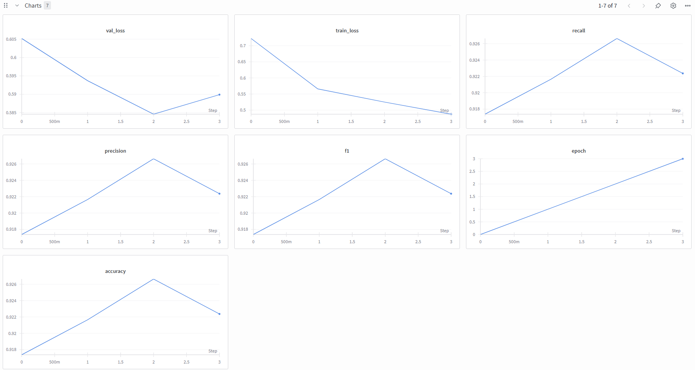

# Research ready classification code 
[](https://github.com/PiotrPotrz/Classification/actions)


A modular PyTorch-based framework for training and evaluating image classification models.
Supports TIMM models, YAML-based dataset configuration, Albumentations augmentations, and W&B experiment tracking.

## Setup

After cloning the repository you must install the dependencies. Use Python 3.13+.

```bash
pip install -r requirements.txt
```

This code is synchronized with W&B. You should log in to your W&B account before starting the training to correctly monitor the training progress.
You can do it with command.

```bash
wandb login YOUR_API_KEY
```

Download the dataset. Create a YAML file with dataset config and place it in data/configs/.

Sample config file should look like the following template

```yaml
# dataset paths
paths:
  train_dataset_path : "./data/datasets/intel_img/seg_train/seg_train"
  val_dataset_path :
  test_dataset_path : "./data/datasets/intel_img/seg_test/seg_test"

# class mapping
class_to_idx:
  buildings: 0
  forest: 1
  glacier: 2
  mountain: 3
  sea: 4
  street: 5

# number of classes
class_num: 6

# image resolution to use in training
img_size: 150
```

In order to train models use main.py. 

For example if you want to train model ResNet18 pretrained on ImageNet using Adam optimizer for 15 epochs on dataset 
Intel Image with checkpoints being saved in directory SAVE_DIR you should run following command.
The dataset argument is the name of YAML config file.

```bash
python3 -m src.main --model resnet18 --optimizer adam --epochs 15 --dataset intel_image --models_save_dir SAVE_DIR
```

With W&B you can easily monitor the training process on their page. It should look like that.



To run inference on a directory MODELS_DIR you should run the following command.

```bash
python3 -m src.inference --models_dir MODELS_DIR
```